# Wa-lang's Manual

- Online manual：[https://wa-lang.github.io/man/en/](https://wa-lang.github.io/man/en/)
- Online manual(Chinese)：[https://wa-lang.org/man/](https://wa-lang.org/man/)
- Github Repo: [https://github.com/wa-lang/man](https://github.com/wa-lang/man)

# 凹语言手册

- 在线地址：[https://wa-lang.org/man/](https://wa-lang.org/man/)
- 在线地址(英文)：[https://wa-lang.github.io/man/en/](https://wa-lang.github.io/man/en/)
- 社区共建：[凹语言 MVP 文档共建邀请](https://zh-lang.osanswer.net/t/topic/247)

