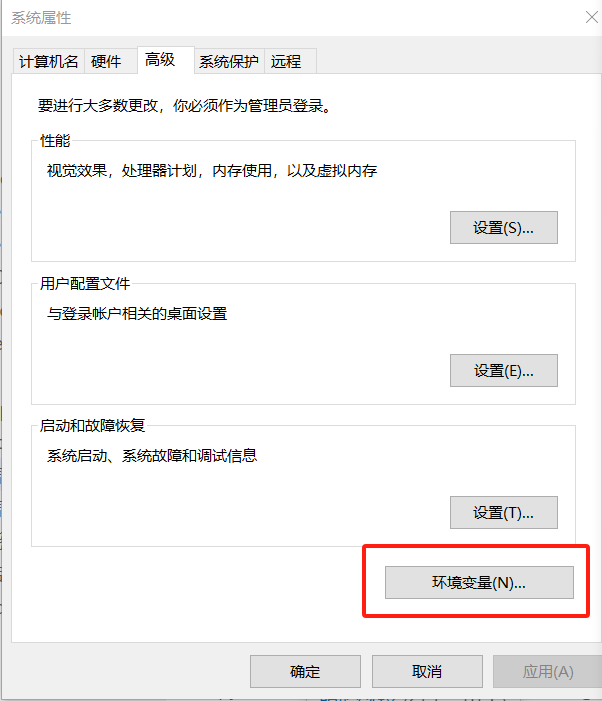

## 2.1. 安装凹语言

除了访问在线的凹语言 Playground，也可以在本地安装凹语言。

### 2.1.1 系统要求

凹语言支持主流的操作系统，包含Windows、macOS、Linux等。凹语言编译器还支持在主流的Chrome等现代浏览器执行。凹语言编译器输出的wasm文件支持主流的WebAssembly虚拟机。

### 2.1.2 二进制安装

打开凹语言在 Github 的镜像仓库，在仓库主页面右侧栏找到最新的发布版本：


点击进入最新发布的版本，在Assets部分找到Windows、macOS、Linux等主流操作系统的二进制包：


根据当前的操作系统选择对应的二进制文件下载。比如 v0.22.0 对应 Windows/amd64 平台下载的是 [wa_v0.22.0_windows-amd64.zip](https://github.com/wa-lang/wa/releases/download/v0.22.0/wa_v0.22.0_windows-amd64.zip)。

下载zip文件后解压到C盘根目录，其目录内容如下：


然后将bin目录对应的`C:\wa\bin`路径添加到当前系统的`PATH`环境变量中。

Windows平台的操作流程：鼠标选择桌面我的电脑，点击右键并在弹出菜单中选择属性，打开控制面板主页。


在左边侧栏选中“高级系统设置”，打开系统属性对话框：



点击右下角的环境变量按钮：


创建Path环境变量，并将`C:\wa\bin`路径添加到环境变量中：


然后重新打开Windows的命令行窗口程序，输入`where wa`查看凹语言编译器对应的wa命令安装情况：


到此Windows平台的凹语言工具链安装完成。

### 2.1.2 从源码安装

对于macOS或Linux系统，可以利用Go语言的包管理工具从源代码安装凹语言编译器。首先是本地安装Go1.17或更新的版本，然后输入以下的命令安装最新的凹语言编译器：

```
go install wa-lang.org/wa@latest
```

默认会安装到 `$HOME/go/bin` 目录，因此需要将该该目录路径添加到系统的 `PATH` 环境。然后可以验证
然后重新打开命令行环境执行一次 `wa` 命令的执行情况。

到此安装工作完成。

### 2.1.3 本地 Playground

安装成功之后，在命令行输入 `wa play` 可以打开本地 Playground。程序会默认打开浏览器页面，也可以输入 [http://localhost:2023/](http://localhost:2023/) 地址访问。效果如下：


点击“执行”按钮，可以看到输出结果。
