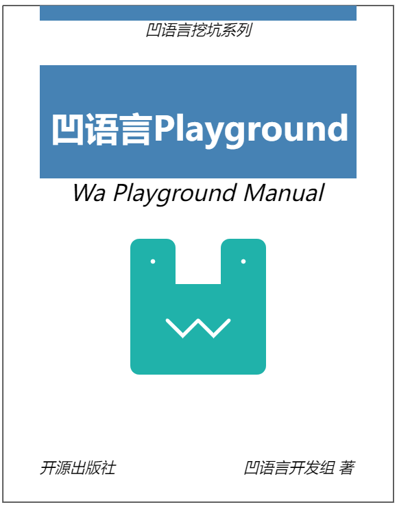
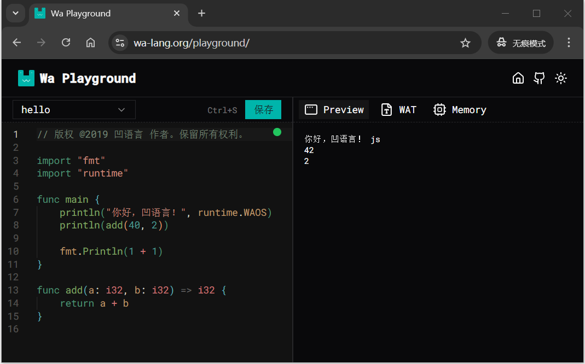
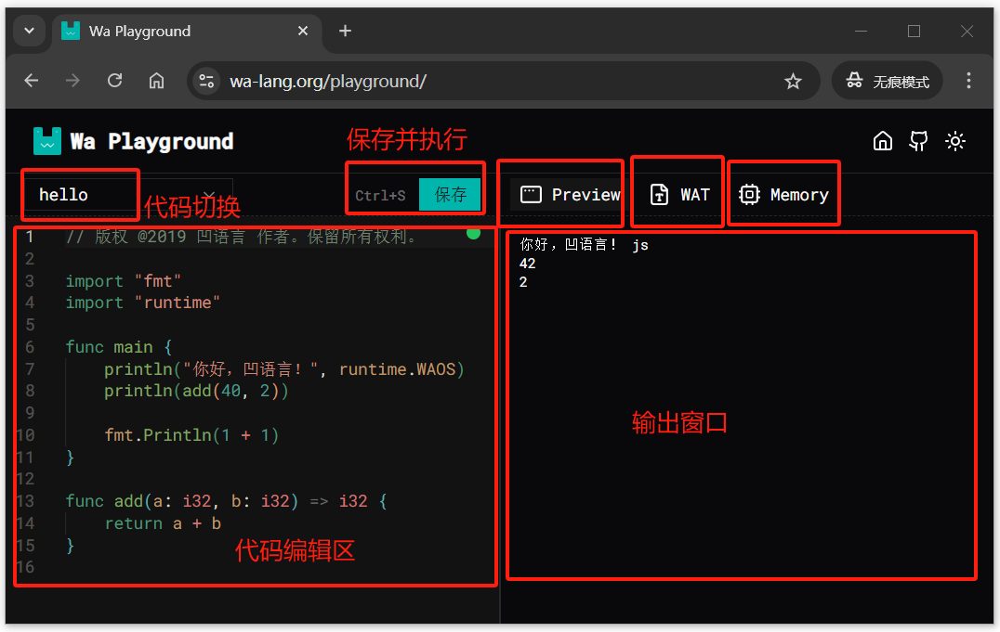
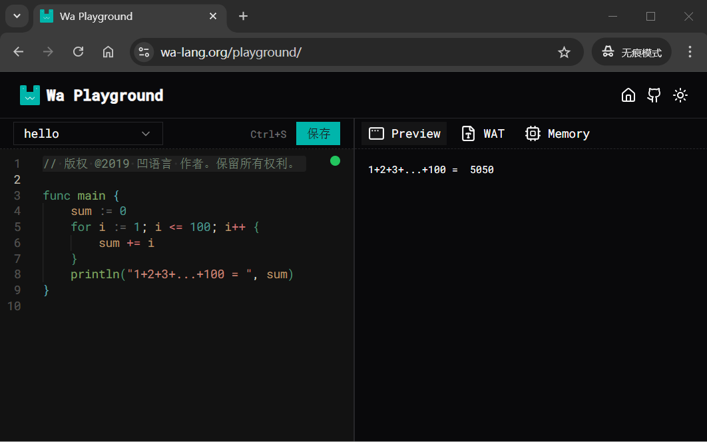
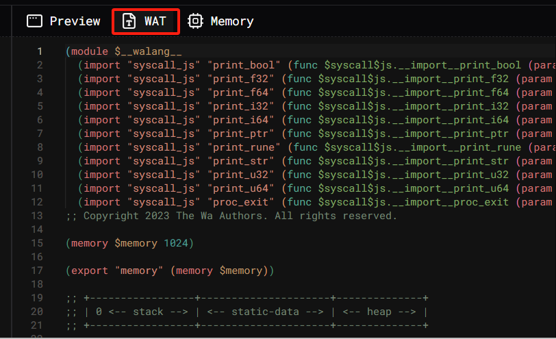
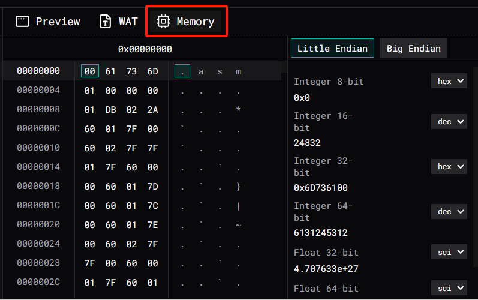
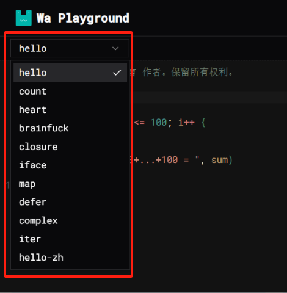
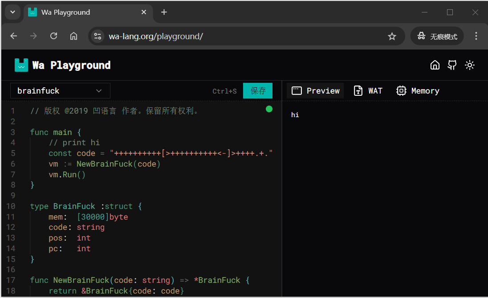
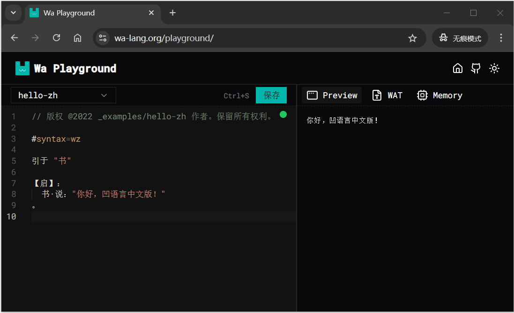

---

## 1. 软件简介

凹语言 Playground 是一个基于浏览器的在线编程环境，用于编写、运行简单的凹语言程序。该系统旨在为开发者和学习者提供一个无需安装、即开即用的便捷平台，适合用于教学、测试和快速原型展示。

---

## 2. 使用方式说明

用户只需通过现代浏览器访问指定网址 [https://wa-lang.org/playground/](https://wa-lang.org/playground/) 即打开入凹语言 Playground 页面，无需下载和安装任何软件。支持桌面和移动端浏览器，推荐使用最新版 Chrome、Edge 或 Firefox 浏览器以获得最佳体验。



---

## 3. 用户界面介绍

系统界面主要由以下几个部分组成：



* **代码编辑区**：提供凹语言语法高亮功能，支持中文标识符、注释和中文示例代码。
* **示例选择器**：内置多个预设示例，包括中文编程示例，可直接加载至编辑器。
* **保存按钮**：点击后可立即保存并编译运行当前代码。
* **Prewview输出区**：用于显示程序运行结果、编译日志或错误信息。
* **WAT查看器**：查看编译生成的 WebAssembly 文本格式（WAT）。
* **Memory查看器** 查看 WebAssembly 二进制格式（WASM）。


---

## 4. 编写与运行代码

用户可在编辑器中直接输入凹语言源代码，支持中文变量名和注释。点击“保存”按钮后，系统将保存代码并启动编译器，生成 WebAssembly 模块并立即执行，运行结果显示在输出区。

比如输入以下代码计算1到100的和：

```
// 版权 @2019 凹语言 作者。保留所有权利。

func main {
	sum := 0
	for i := 1; i <= 100; i++ {
		sum += i
	}
	println("1+2+3+...+100 = ", sum)
}
```

执行效果如下：



Playground 还提供 WAT，展示编译后的 WebAssembly 文本表示形式：



和查看 WASM 二进制格式的功能：



程序在保存时运行前会自动进行格式化。

---

## 5. 示例程序演示

Playground 内置多个示例程序，可以通过示例切换程序选择：



涵盖hello、count、heart、brainfuck、closure、iface、map、defer、complex、iter和hello-zh等。

其中brainfuck例子展示了凹语言执行BF语言虚拟机的能力：



hello-zh例子则展示中文编程的能力：




---

## 6. 常见问题与注意事项

* 推荐使用Chrome浏览器，老版本的浏览器可能存在部分兼容性限制。
* 编译错误信息将在输出区显示，注意检查语法或变量定义是否正确。
* 若运行无反应，请检查网络是否连接或刷新页面。


